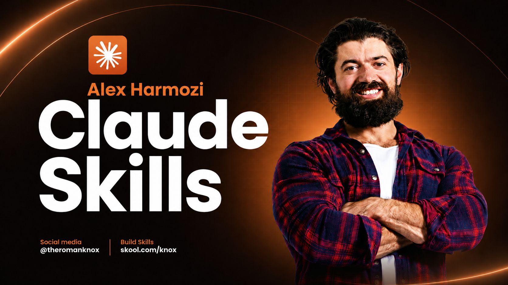

# Hormozi Sales & Cold Outreach — Claude Skills



> **Three Claude Code skills that turn a cold list into booked calls and a weak offer into one people feel stupid saying no to.** Built around Alex Hormozi's offer and business frameworks plus eight cold-outreach systems (Hormozi, Kennedy, Cialdini, Cardone, Belfort, Brunson, Godin, Gary Vee) — routed automatically to whatever you're stuck on.

This is the actual skill pack I keep loaded when I'm writing offers and outreach for [knoxhub.io](https://knoxhub.io) and pitching the [Knox Community](https://www.skool.com/knox-community-7232/). Not a demo. The real thing.

> **Credit:** The frameworks here are distilled from public books, talks, and interviews (Alex Hormozi's *$100M Offers* and *$100M Leads*, Dan Kennedy, Robert Cialdini, Grant Cardone, Jordan Belfort, Russell Brunson, Seth Godin, Gary Vaynerchuk). Packaged into Claude skills by Roman Knox. Buy their books — they're worth it.

---

## What's inside

Three skills, each a self-contained `SKILL.md` you drop into Claude Code:

### 1. `alex-hormozi-pitch` — Grand Slam Offers
Build offers so good they're hard to refuse, using Hormozi's *$100M Offers* method.
- The **Value Equation** — Dream Outcome × Perceived Likelihood ÷ (Time Delay × Effort)
- The four **guarantee types** (unconditional, conditional, outcome-based, anti-guarantee)
- The **MAGIC** naming formula
- Value-stack and bonus construction, scarcity, urgency, objection elimination

### 2. `alex-hormozi-from-zero` — The Operator's Field Guide
Eleven framework clusters covering 0-to-1 through $10M+, routed to your exact stage and block.
- Fear OS, the 3 Ps of business ideas, Brand Mosaic + Core Four
- Volume Not Volatility, Stick To One Thing, Barrels & Ammunition, 3D training
- Leverage Ladder, Hypothesis-First thinking, More/Better/New allocation
- Asks you clarifying questions first, then prescribes — no generic answers

### 3. `cold-outreach-board` — 8 Persuasion Systems, 1 Router
Describe your outreach problem; it routes to the right expert and writes the message.
- **No replies** → Hormozi lead-magnet opener · **Too salesy** → Cialdini reciprocity
- **Ghosted** → Cardone 10X follow-up · **Don't know what to say** → Kennedy PAS
- **Can't close the DM** → Belfort Straight Line · **Funnel logic** → Brunson value ladder
- **Positioning** → Godin smallest viable audience · **Trust from zero** → Gary Vee jab-jab-hook

---

## Why this beats writing it yourself

Most offers die on the Value Equation and most cold outreach dies on the opening line. These skills don't hand you a template — they diagnose first:

1. **Stage and block before tactics.** Every skill asks where you are and what's actually stopping you, then routes. A $0 founder and a $1M founder get different answers.
2. **Component-level, not category-level.** "Ads don't work" is a beginner diagnosis. These skills push you to the exact step in the sequence that breaks.
3. **Specific over clever.** Real scarcity over fake. Documented results over claims. Third-grade reading level on cold messages (Hormozi tested it — 50% more replies).

---

## Install

Clone into your Claude Code skills directory:

```bash
cd ~/.claude/skills
git clone https://github.com/rediumvex/hormozi-sales-cold-outreach-claude.git
```

The three skill folders (`alex-hormozi-pitch`, `alex-hormozi-from-zero`, `cold-outreach-board`) are inside. Move them up one level so Claude discovers each:

```bash
cd ~/.claude/skills/hormozi-sales-cold-outreach-claude
mv alex-hormozi-pitch alex-hormozi-from-zero cold-outreach-board ~/.claude/skills/
```

gstack users:

```bash
cd ~/.claude/skills/gstack
git clone https://github.com/rediumvex/hormozi-sales-cold-outreach-claude.git
```

Restart Claude Code so it picks up the new skills.

## Usage

```
Build me a Grand Slam Offer for a $3k/mo done-for-you LinkedIn ghostwriting service.
```

```
I quit my job 4 months ago, I'm at $2k MRR and stuck. What do I do next?
```

```
I'm sending 40 cold DMs a day on Instagram to coaches, getting maybe 2 replies and zero calls. Fix it.
```

```
My offer converts on calls but nobody books the call from my outreach. Diagnose where it breaks.
```

## Who built this

I'm **Roman Knox** — I build AI products that make money, not demos.

- 📸 Instagram: [@roman.knox](https://instagram.com/roman.knox) — 280K+ followers
- 🏫 [Knox Community](https://www.skool.com/knox-community-7232/) — builders shipping real AI products
- 🌐 [knoxhub.io](https://knoxhub.io)
- 📺 YouTube: [@AI-GPTWorkshop](https://youtube.com/@AI-GPTWorkshop)
- 🤖 My other Claude skills: [SEO Blog Writer](https://github.com/rediumvex/seo-blog-writer-claude) · [Social Media Caption Generator](https://github.com/rediumvex/social-media-caption-generator-claude) · [Viral Hooks](https://github.com/rediumvex/viral-hooks-skill) · [AI Video Generator](https://github.com/rediumvex/ai-video-generator-claude) · [AI Marketing Toolkit](https://github.com/rediumvex/ai-marketing-claude)

## License

MIT — see [LICENSE](LICENSE). Framework credit to the authors listed above; packaging © 2026 Roman Knox.

If this saved you time, a ⭐ on the repo is appreciated.
